This repository is a replacement for the https://srmreports.emc.com website.

It hosts custom reports from the community.

Feel free to contribute ;-)

Report list:
- [Deployment instructions](#deployment-instructions)
- [VPLEX CPU Core Stats](#vplex-cpu-core-stats)
- [Device Discovery Date and Last Seen](#device-discovery-date-and-last-seen)
- [Cisco Port Overview and Line Card Report](#cisco-port-overview-and-line-card-report)
- [CTG - Dell EMC Storage Dashboards](#ctg---dell-emc-storage-dashboards)
- [M&R Reports](#mr-reports)
- [Unbalanced HBA ports VMware](#unbalanced-hba-ports-vmware)
- [File System to LUN](#file-system-to-lun)
- [VMware Chargeback All-in-One](#vmware-chargeback-all-in-one)
- [Isilon Cluster IOPS](#isilon-cluster-iops)
- [SRM vApp Server File Systems (Health Report)](#srm-vapp-server-file-systems-health-report)
- [Code Levels Report](#code-levels-report)
- [HyperV List of VM's with IOPS (corrected)](#hyperv-list-of-vms-with-iops-corrected)
- [VMAX Top Ten LUNs (IOPS)](#vmax-top-ten-luns-iops)
- [VMWare - ESX Host Cluster Inventory.](#vmware---esx-host-cluster-inventory)
- [CTG -> Capacity Trending](#ctg---capacity-trending)
- [CTG -> VNX Storage Group Capacity Trending Report](#ctg---vnx-storage-group-capacity-trending-report)
- [VPLEX Performance View](#vplex-performance-view)
- [CTG -> VMAX Storage Group Capacity Trending Report](#ctg---vmax-storage-group-capacity-trending-report)
- [CTG -> SolutionPacks Metric Count w/ Metrics per Device](#ctg---solutionpacks-metric-count-w-metrics-per-device)
- [CTG -> Chargeback/Showback - Physical Host Capacity (by Frame)](#ctg---chargebackshowback---physical-host-capacity-by-frame)
- [CTG -> Management Performance Dashboard](#ctg---management-performance-dashboard)
- [CTG -> Host Capacity Trending](#ctg---host-capacity-trending)
- [CTG -> Health Dashboard - Device Alert Dashboard](#ctg---health-dashboard---device-alert-dashboard)
- [Visual VNX Disk Slot Status](#visual-vnx-disk-slot-status)
- [LUN Used Growth over 1 or 2 weeks](#lun-used-growth-over-1-or-2-weeks)
- [Dashboard Performance and Capacity by Location and Business Unit](#dashboard-performance-and-capacity-by-location-and-business-unit)
- [Pool Forecast by Array](#pool-forecast-by-array)
- [Datastore List with Array and Host information](#datastore-list-with-array-and-host-information)
- [VPLEX Port statistic based on switch port octets](#vplex-port-statistic-based-on-switch-port-octets)
- [Hypervisor VM load analysis](#hypervisor-vm-load-analysis)
- [CTG -> Tailored Chargeback/Showback Reports](#ctg---tailored-chargebackshowback-reports)
- [CTG -> System Performance - SotS Reports](#ctg---system-performance---sots-reports)
- [CTG -> VPLEX SV TimeFrame Report](#ctg---vplex-sv-timeframe-report)
- [Datastore Utilization](#datastore-utilization)
- [Storage Systems - Health (SRM 4.0 Update)](#storage-systems---health-srm-40-update)
- [Vmguest and Host Primary Presented Allocated and Used Chargeable](#vmguest-and-host-primary-presented-allocated-and-used-chargeable)
- [Isilon and DataDomain Executive Dashboard](#isilon-and-datadomain-executive-dashboard)
- [Vmguest and Host Primary Presented-Total Allocated and Used-Total Chargeable](#vmguest-and-host-primary-presented-total-allocated-and-used-total-chargeable)
- [Storage Utilization for Different Kinds of Arrays in ViPR SRM (Trending)](#storage-utilization-for-different-kinds-of-arrays-in-vipr-srm-trending)
- [Storage Consumed by Application](#storage-consumed-by-application)
- [Storage System Capacity Consumption](#storage-system-capacity-consumption)
- [CTG -> System Performance - By Device Reports](#ctg---system-performance---by-device-reports)
- [CTG -> System Performance - TimeFrame Compare](#ctg---system-performance---timeframe-compare)
- [CTG -> Array-Pool Capacity Reports (Capacity Planning & Forescasting Report Bundle)](#ctg---array-pool-capacity-reports-capacity-planning--forescasting-report-bundle)
- [Simple Capacity Planning](#simple-capacity-planning)
- [Isilon Quota Reports](#isilon-quota-reports)
- [Isilon Performance Summary](#isilon-performance-summary)
- [Isilon Capacity Summary](#isilon-capacity-summary)
- [Vmguest Health Check Last 6 Months](#vmguest-health-check-last-6-months)
- [System Summary Report](#system-summary-report)

# Deployment instructions
Follow the below steps to install the customer report

1. Download the report definition
1. Login to the SRM instance where the report is to be deployed
1. Select My Reports and Select Edit Mode at the top (You must have permission to do this)
1. Make sure you Select My Reports on the Left Hand Tree
1. Select the Settings Action Button located next to the Username in the upper right corner
1. You should see a popup window for user settings. Select the Custom Tree Tab
1. Select Browse: Locate the XML file you want to import
1. Select Save to upload the selected Custom report XML file
1. Select BROWSE MODE to exit EDIT MODE. View the Custom Report


# VPLEX CPU Core Stats
<a href="https://raw.githubusercontent.com/coulof/srmreports/master/reports/VPLEX_CPU_Core_Stats.xml">DOWNLOAD</a>

**author:** nicolas.friedland-meriaux@raiffeisen.ch

**version:** 4.3

**description:** Since in VPLEX it is sometimes of interest to see how much the CPU-Cores are utilized this is a report to show this.

# Device Discovery Date and Last Seen
<a href="https://raw.githubusercontent.com/coulof/srmreports/master/reports/Device_Discovery_Date_and_Last_Seen.xml">DOWNLOAD</a>

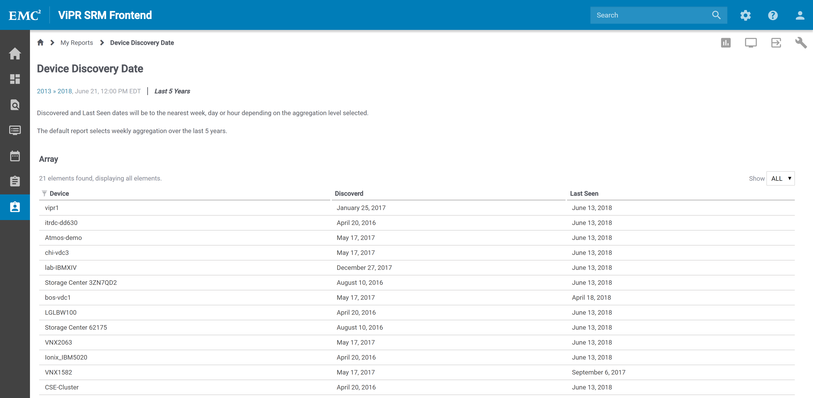

**author:** graham.brown2@emc.com

**version:** 4.1

**description:** This report provides a table per device type listing the discovery date and last seen date for each device of that type. The default report settings are to use weekly aggregates and to look back over the last 5 years. Therefore the date given will be within a week of the discover date and last seen by date. Changing the report to use daily aggregates will give a better granularity but as the default SRM settings are to keep daily data for 1 year this is only really useful for devices that have been discovered in the last year.# srmreports

# Cisco Port Overview and Line Card Report
<a href="https://raw.githubusercontent.com/coulof/srmreports/master/reports/Cisco_Port_Overview_and_Line_Card_Report.xml">DOWNLOAD</a>

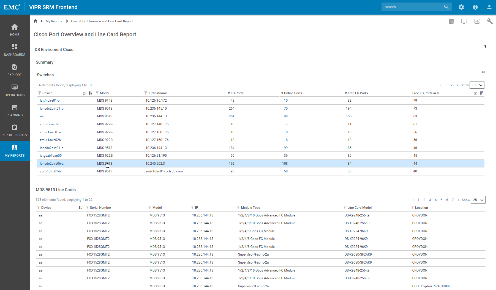

**author:** thomas.lanze@emc.com

**version:** 4.1

**description:** Customer have a big Cisco environment and different price structures for Linecard Ports. So as an example he has to pay 1$ per Port from a DS-X9232-256K9 but $1.5 per Port from a DS-X9248-256K9. Vipr SRM didn’t give these kind of Information by default. The only information u can get is the Moule Type for this Kind of card as an example 1/2/4/8/10 Gbps Advanced FC Module. Cisco also have different kind of Crossbars, as an example DS-13SLT-FAB2, with different dates of EOL / EOS etc. Vipr SRM didn’t give these kind of information by default.

Solution: All of the information is there from the entity mib, which is installed by default. But the cisco collector has to been pointed to get these information. For this I have added in the snmp-masks.xml a line under the Rubrik CISCO-ENTITY-FRU.

Here is modified version of the snmp-masks file :

How to handle:
1. Make a backup of your old snmp-masks.xml file
2. Copy the modifieded version into the folder `APG/Collecting/SNMP-Collector/cisco-mds-nexus/conf`
3. Make an update of the services `cd /opt/APG/bin/ ./manage-modules.sh service update all`
```
        Stopping 'topology-mapping-service Default'... [ OK ]
        Stopping 'task-scheduler Default'... [ OK ]
        Stopping 'script-engine Default'... [ OK ]
        Stopping 'event-processing-manager emc-watch4net-health'... [ OK ]
        Stopping 'collector-manager emc-watch4net-health'... [ OK ]
        Stopping 'collector-manager cisco-mds-nexus'... [ OK ]
        Stopping 'collector-manager Load-Balancer'... [ OK ]
        Stopping 'collector-manager Generic-SNMP'... [ OK ]
        Stopping 'webservice-gateway Default'... [ OK ]
        Updating service 'topology-mapping-service Default'... [ updated ]
        Updating service 'webservice-gateway Default'... [ updated ]
        Updating service 'collector-manager Generic-SNMP'... [ updated ]
        Updating service 'collector-manager Load-Balancer'... [ updated ]
        Updating service 'collector-manager cisco-mds-nexus'... [ updated ]
        Updating service 'collector-manager emc-watch4net-health'... [ updated ]
        Updating service 'event-processing-manager emc-watch4net-heal... [ updated ]
        Updating service 'script-engine Default'... [ updated ]
        Updating service 'task-scheduler Default'... [ updated ]
```
1. Start the services and wait a few cycles
1. After this u will have in your running database a new property with name linemodel


# CTG - Dell EMC Storage Dashboards
<a href="https://raw.githubusercontent.com/coulof/srmreports/master/reports/CTG_-_Dell_EMC_Storage_Dashboards.xml">DOWNLOAD</a>

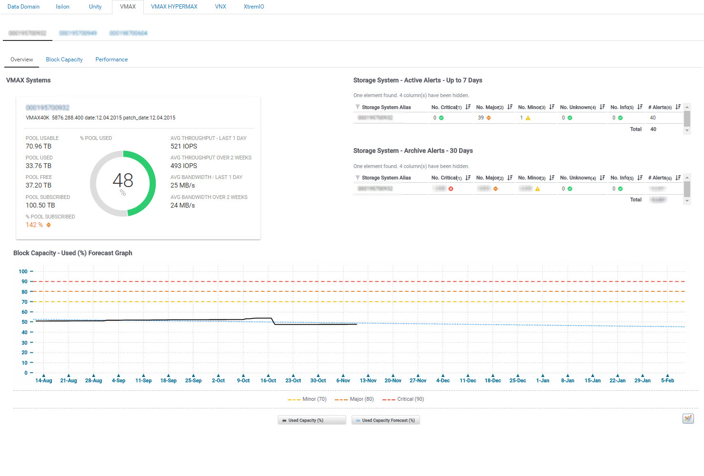

**author:** scott.speer@emc.com

**version:** 4.1

**description:** This report bundles contains (4) reports within v1.0 and offers a few quick ways to look at a supported Dell EMC platforms without much outside navigation.

Report Details - https://centraltexasgeek.com/2017/11/13/ctg-dell-emc-storage-dashboards/

Requirements for report to work: SRM 4.1 & Higher - If you need this report for 4.0.x, I can change some of the display settings I have used, which were added within SRM 4.1. Just shot me an email if you need this report converted to 4.0.x.

Dell EMC Storage Platforms supported: v1 – Data Domain, Isilon, Unity, VMAX, VMAX HYPERMAX, VNX, XtremIO

# M&R Reports
<a href="https://raw.githubusercontent.com/coulof/srmreports/master/reports/MnR_Reports.xml">DOWNLOAD</a>

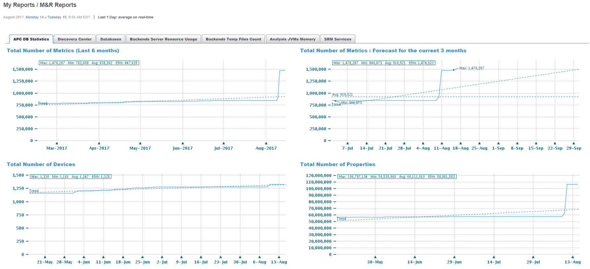

**author:** damien.mas@emc.com

**version:** 4.1

**description:** This report template will give you a good overview of your SRM environment

# Unbalanced HBA ports VMware
<a href="https://raw.githubusercontent.com/coulof/srmreports/master/reports/Unbalanced_HBA_ports_VMware.xml">DOWNLOAD</a>

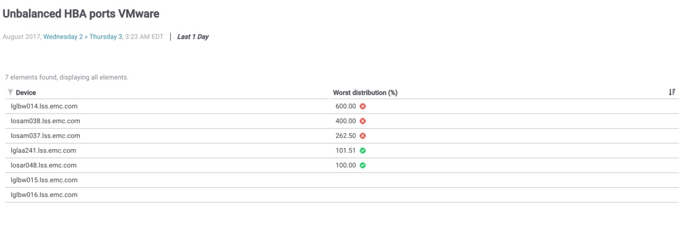

**author:** florian.coulombel@emc.com

**version:** 4.0

**description:** This report helps to identify is HBA traffic is correctly balanced among the cards. The closer the value is to 100% the more balanced the traffic is.

Any value over 200% means that not all the cards are used

# File System to LUN

<a href="https://raw.githubusercontent.com/coulof/srmreports/master/reports/File_System_to_LUN.xml">DOWNLOAD</a>

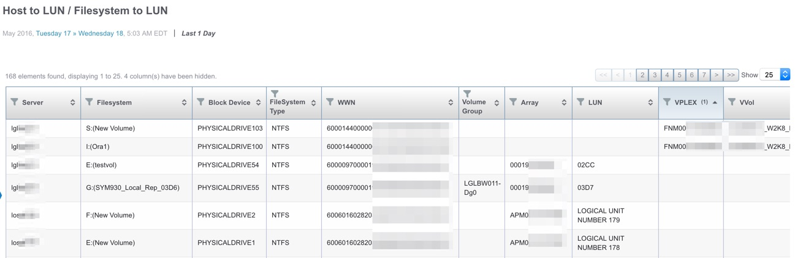

**author:** florian.coulombel@emc.com

**version:** 4.0

**description:** That report shows in one table the Physical Hosts File Systems related LUNs

# VMware Chargeback All-in-One
<a href="https://raw.githubusercontent.com/coulof/srmreports/master/reports/VMware_Chargeback_All-in-One.xml">DOWNLOAD</a>

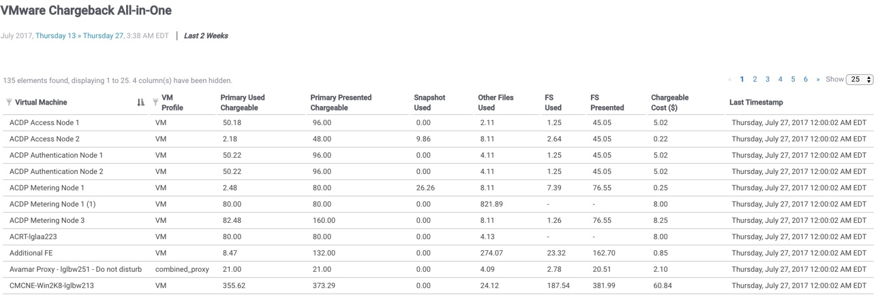

**author:** florian.coulombel@emc.com

**version:** 4.0

**description:** That report shows in a single table :

* Block Used & Presented capacities
* File system Used & Presented capacities
* The Snapshot used & Other files used (swap, logs, etc.)

The drill-down shows the details of RDM disks, File systems, VM files & datastore.

# Isilon Cluster IOPS
<a href="https://raw.githubusercontent.com/coulof/srmreports/master/reports/Isilon_Cluster_IOPS.xml">DOWNLOAD</a>

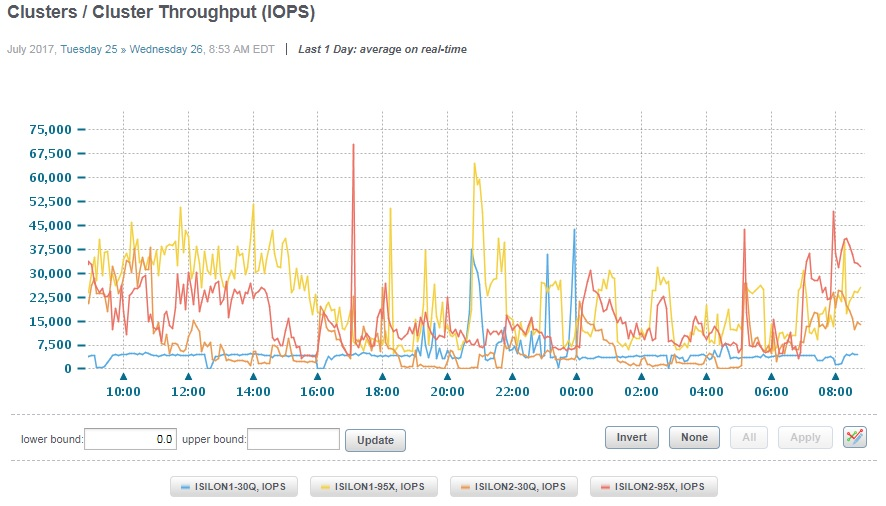

**author:** michael.hamelink@its.ny.gov

**version:** 4.0

**description:** This is a custom report I put together in response to executive management asking for IOPS data on our Isilon clusters. Although there are no (functional) IOPS metrics at the cluster or bay level, I was able to calculate them at the disk level, then sum those up to the bay level, then finally sum the bay IOPS up to the device level to achieve cluster IOPS totals. At the top level the report shows you the total IOPS per cluster, but if you drill down into one of the clusters it will provide Read, Write, and Total IOPS.

This report was built in 3.7.1 but works fine in 4.0.X

My suggestion would be to add copies of the report right alongside the canned bandwidth reports in the following locations**, however it can be placed anywhere:

All>>EMC Isilon 4.0.2>>Cluster Summary>>serialnb>>Performance>>Cluster Performance

All>>EMC Isilon 4.0.2>>Performance>>Clusters

** Keep in mind that if you add to the canned report packs, it will be lost upon SRM upgrade.


# SRM vApp Server File Systems (Health Report)
<a href="https://raw.githubusercontent.com/coulof/srmreports/master/reports/SRM_vApp_Server_File_Systems_Health_Report.xml">DOWNLOAD</a>

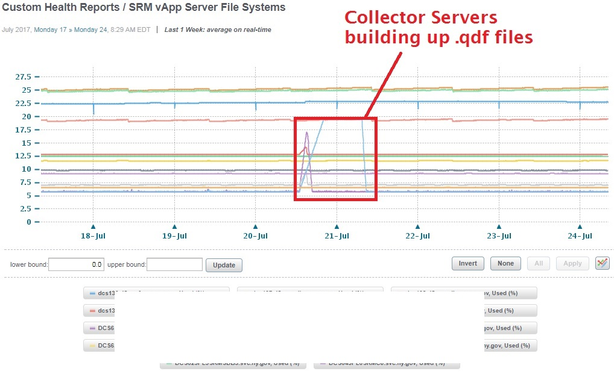

**author:** michael.hamelink@its.ny.gov

**version:** 4.0

**description:** This report will show you file system usage of all the servers in the SRM vApp. If you see any of the collector servers deviating from a straight line, it likely means that there is a communication/Load Balancer issue that needs to be addressed immediately.


# Code Levels Report
<a href="https://raw.githubusercontent.com/coulof/srmreports/master/reports/Code_Levels_Report.xml">DOWNLOAD</a>

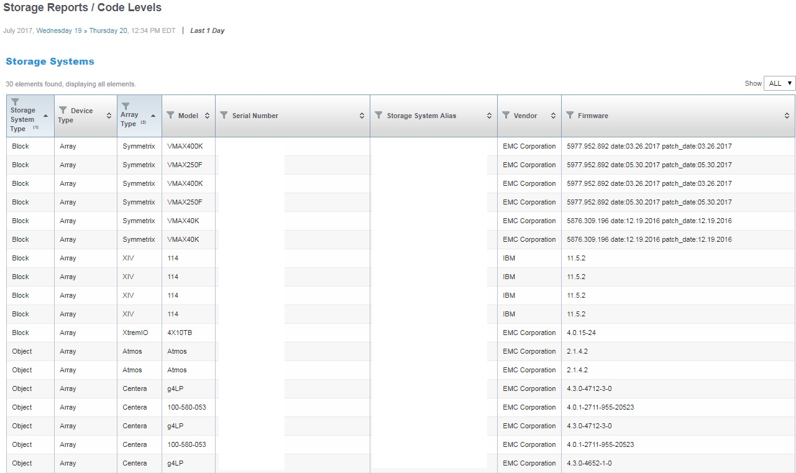

**author:** michael.hamelink@its.ny.gov

**version:** 4.0

**description:** This report has two sections: Storage Systems and Switches:

* The Storage section lists out all the various devices (Block, File, Unified, Object) that SRM knows about and lists out pertinent information such as type of storage, vendor, S/N, device name, model, and firmware level.
* The Switch report gives code level, along with some basic information such as vendor, model, IP and ports in use.

This was built in 3.7 but works in 4.0.2 and presumably any other version as there are no links.

# HyperV List of VM's with IOPS (corrected)
<a href="https://raw.githubusercontent.com/coulof/srmreports/master/reports/HyperV_List_of_VMs_with_IOPS_corrected.xml">DOWNLOAD</a>

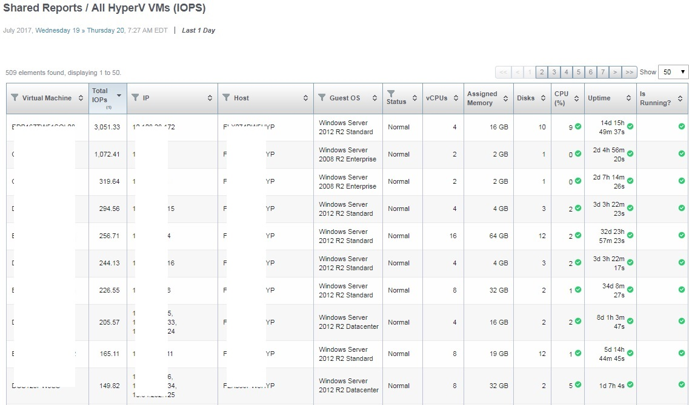

**author:** michael.hamelink@its.ny.gov

**version:** 4.0

**description:** In v3.7 there was no IOPS provided in the list of VM's. In 4.0.2, the list of VM's does provide IOPS, however it is coded incorrectly and for each VM chooses a single disk at random and display's that disk's IOPS. This report sums the IOPS from all disks on a VM and displays that total value in the list of VM's.

This was built using the 3.7 reports but runs fine on 4.0.2 and presumably other versions.

# VMAX Top Ten LUNs (IOPS)
<a href="https://raw.githubusercontent.com/coulof/srmreports/master/reports/VMAX_Top_Ten_LUNs_IOPS.xml">DOWNLOAD</a>

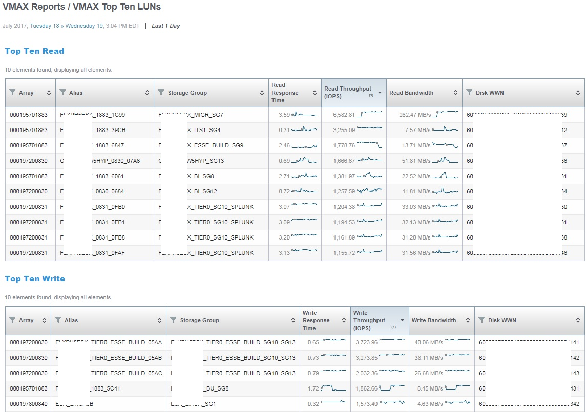

**author:** michael.hamelink@its.ny.gov

**version:** 4.0

**description:** This is a simple report I run every morning that returns the 10 highest Read IOPS LUNs and the 10 highest Write IOPS LUNs on any of our VMAX arrays. Several times a year this report has helped us quickly catch a misbehaving server. Added in custom columns for LUN aliases (alias) as well as UID/WWN (partsn).

Since this report simply filters for all LUNs on any VMAX arrays, no customization should be needed. This was built with 3.7 reports but works on higher versions.

# VMWare - ESX Host Cluster Inventory.
<a href="https://raw.githubusercontent.com/coulof/srmreports/master/reports/VMWare_-_ESX_Host_Cluster_Inventory.xml">DOWNLOAD</a>

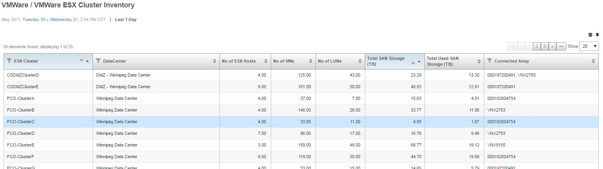

**author:** vaishak.nair@gwl.ca

**version:** 4.0

**description:** This report gives a high level view of the VMWare ESX Clusters, drill down on each row to get more details about Hypervisors, Datastores, Virtual Machines and SAN Disks belonging to that Cluster.


# CTG -> Capacity Trending
<a href="https://raw.githubusercontent.com/coulof/srmreports/master/reports/CTG_-_Capacity_Trending_v2.xml">DOWNLOAD</a>


**author:** scott.speer@emc.com

**version:** 4.1

**description:** Uploaded v2 on 5/31/17 which adds additional reports.

A reader requested a “global” capacity trending report. We had a quick discussion and the results are outlined below. The majority of the base report is based off of the Enterprise Capacity, File Capacity, and Object Capacity reports with some modifications, because that is how I roll… Really, I’m just looking to see if anyone ever reads this before they download and try the report. I also broke out the Data Domain and XIO to provide some additional context per the request.

The reports are broken down by Block, File, Object, DD and XIO Details. Do note that the XIO is included in the block capacity but as it does not truly list out volume details, I added the XIO Details report to provide some additional insight. My demo environment only has 2 weeks of data, thus the screenshots below will show the lack of data

This report includes (4) main reports via tabs. The “Capacity Trending by Location” report will not appear if you are not utilizing data enrichment on the “location” property.

Report 1 – Capacity Trending (All Arrays) - This report provides a summary and trend of all arrays per category (Block, File, Object, DD, XIO Details). Report 2 – Capacity Trending by Array Type - This report uses the same categories outlined above but adds another tab to allow you to trend by array type versus all arrays of the same category. Report 3 – Capacity Trending by Array Type & Device - Same as above but adds an additional tab to trend on specific devices. Report 4 – Capacity Trending by Location - Same as report 1 but by location, thus you can see capacity per location. If you are not utilizing the “location” property this report will remain hidden.

Requirements for report to work: SRM 4.0 & Higher Direct Blog Post - https://centraltexasgeek.com/2017/05/26/ctg-capacity-trending/


# CTG -> VNX Storage Group Capacity Trending Report
<a href="https://raw.githubusercontent.com/coulof/srmreports/master/reports/CTG_-_VNX_Storage_Group_Capacity_Trending_Report.xml">DOWNLOAD</a>

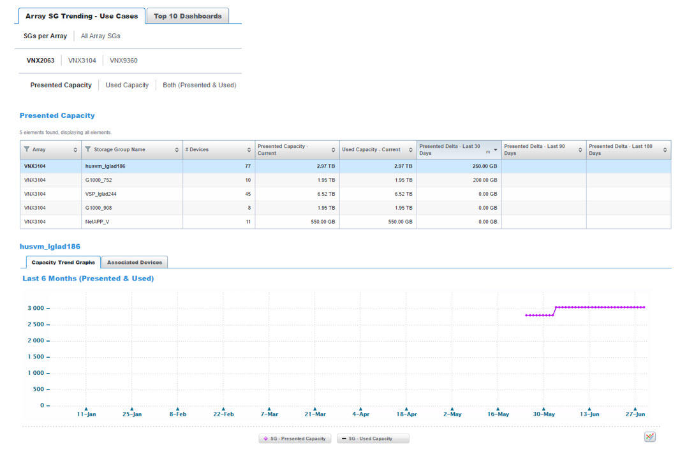

**author:** scott.speer@emc.com

**version:** 4.1

**description:** I received a request on my blog for a capacity trending per VNX Storage Group. I essentially modeled this report using my host capacity trending report. The report is using LUN capacity data (Presented/Used). As a reminder, the “Used” capacity will show the actual LUN used capacity. If the LUN is thick provisioned it will show the same size as the “Presented” capacity. Some of my columns are blank as I do not have historical data in the demo system I used to take screenshots.

Notes: Some of my columns in my screenshots are blank as I do not have historical data in the demo system I used to take screenshots. Requirements for report to work: SRM 4.0 & Higher, If running SRM 4.0.x, a formula change is needed in order for the report to work. If running SRM 4.1 or later, no change is needed. Please search for this report on my blog outlined below for the details on how to edit the existing delta formula.


# VPLEX Performance View
<a href="https://raw.githubusercontent.com/coulof/srmreports/master/reports/VPLEX_Performance_View.xml">DOWNLOAD</a>

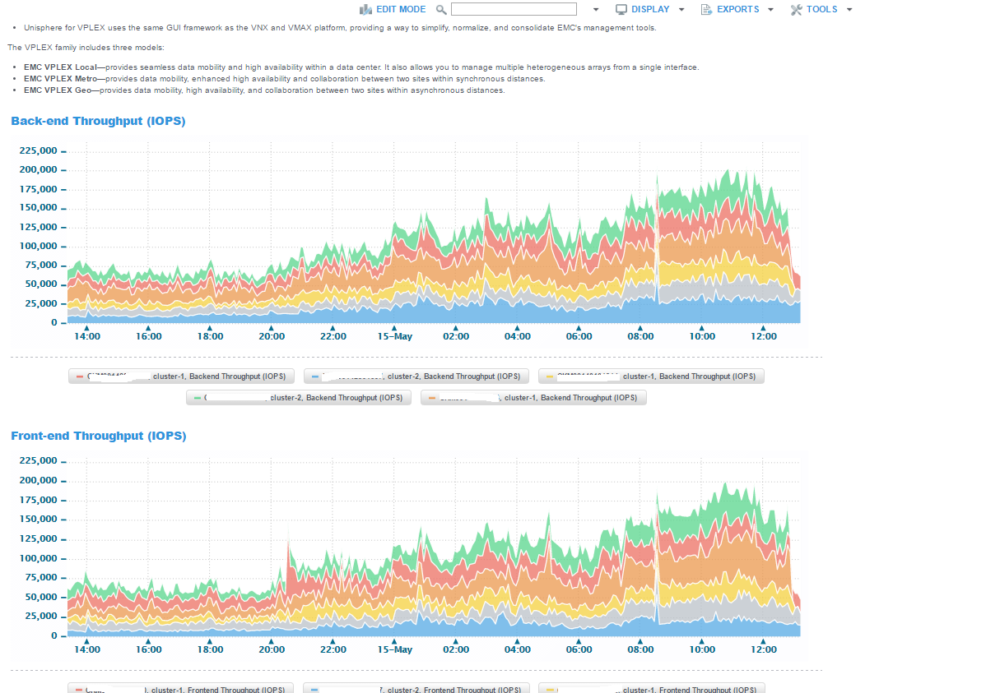

**author:** rahul.raghavan@socgen.com

**version:** 4.0

**description:** This report is made to have all in one view for VPLEX Performance view for all kind ,Metro ,Local .

The report made with necessary tweak from the standard VPLEX subsidiary reports and comprises of Backend Thorughput (IOPS) ,FE through pout (IOPS),Director Utilization ,CPU resource utilization

# CTG -> VMAX Storage Group Capacity Trending Report
<a href="https://raw.githubusercontent.com/coulof/srmreports/master/reports/CTG_-_Capacity_Trending.xml">DOWNLOAD</a>

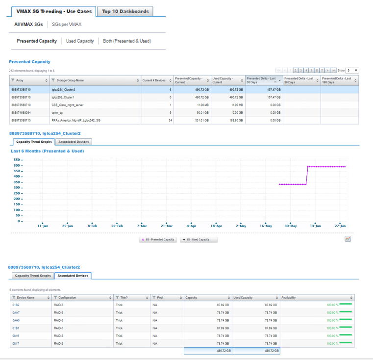

**author:** scott.speer@emc.com

**version:** 4.1

**description:** I received a request on my blog for a capacity trending per VMAX Storage Group. I essentially modeled this report using my host capacity trending report. The report is using LUN capacity data (Presented/Used). As a reminder, the “Used” capacity will show the actual LUN used capacity. If the LUN is thick provisioned it will show the same size as the “Presented” capacity. Some of my columns are blank as I do not have historical data in the demo system I used to take screenshots.

Notes: Some of my columns in my screenshots are blank as I do not have historical data in the demo system I used to take screenshots. Requirements for report to work: SRM 4.0 & Higher, If running SRM 4.0.x, a formula change is needed in order for the report to work. If running SRM 4.1 or later, no change is needed. Please search for this report on my blog outlined below for the details on how to edit the existing delta formula.

Check out the SRM tips & tricks as well the full report details by searching by the report name on my blog @ www.centraltexasgeek.com

# CTG -> SolutionPacks Metric Count w/ Metrics per Device
<a href="https://raw.githubusercontent.com/coulof/srmreports/master/reports/CTG_-_SolutionPacks_Metric_Count_w__Metrics_per_Device.xml">DOWNLOAD</a>

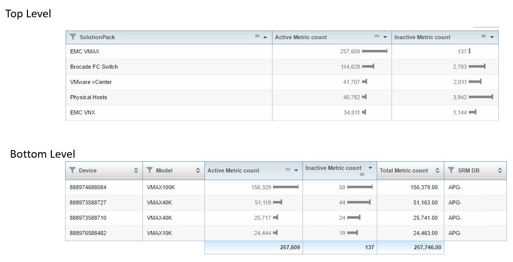

**author:** scott.speer@emc.com

**version:** 4.1

**description:** This report allows you to do the following: See active/inactive metrics per SP Determine which devices have the most active/inactive metrics Quickly determine which databases your devices are using

# CTG -> Chargeback/Showback - Physical Host Capacity (by Frame)
<a href="https://raw.githubusercontent.com/coulof/srmreports/master/reports/CTG_-_Chargeback_Showback_-_Physical_Host_Capacity_by_Frame.xml">DOWNLOAD</a>


**author:** scott.speer@emc.com

**version:** 4.0

**description:** This report takes the OOTB chargeback report and gives it a little perspective change. this report allows you to see how much capacity is presented/used by frame versus taking a host approach. As you drill in you are able to see the hosts per frame as well as the LUN data points you expect from the OOTB report.

Requirements for report to work: SRM 4.0 & Higher, Chargeback SolutionPack has to be installed, Hosts have to be discovered (actively of passively) in order to appear in the report (This is a standard requirement for the base ViPR SRM chargeback reports)

# CTG -> Management Performance Dashboard
<a href="https://raw.githubusercontent.com/coulof/srmreports/master/reports/CTG_-_Management_Performance_Dashboard.xml">DOWNLOAD</a>

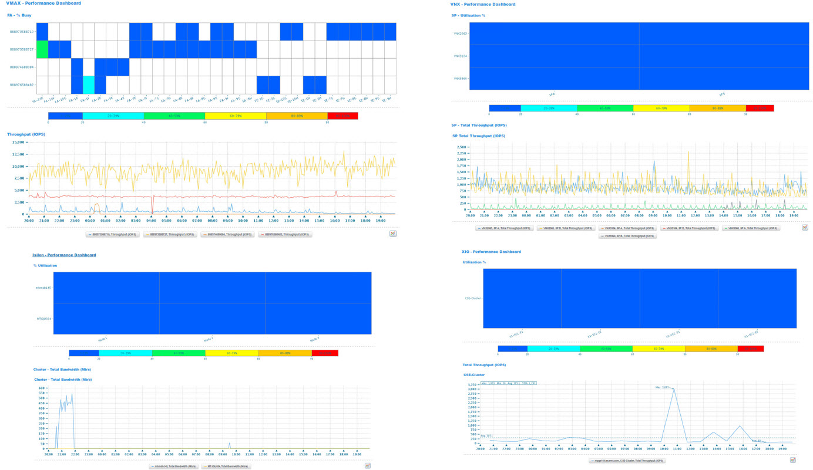

**author:** scott.speer@emc.com

**version:** 4.0

**description:** I had a customer whom liked some of my system performance reports but requested a simple daily performance dashboard for their management team. The idea was that management could get this emailed to them daily but they also wanted to be able to log into SRM and look at their custom ReportPack to see the report in real time.

I asked them a few questions about what their management team might want to see and here it is… The outcome was a heatmap and the most common KPI looked at when considering the performance of the system in question. Keep in mind they have my other system performance reports to drill into thus we started simple since the management team really didn’t know what they wanted to see. What you will see below is a pretty simple report that shows all device types on the same widgets (heatmap & KPI). This user has a very large environment, thus we added in a second level expansion to create different sections by data center. I have removed that within the attached report below. If your environment is large, you might want to consider adding in the second level expansion as the performance charts are going to be hard to read with lots of devices.

Requirements for report to work: SRM 4.0 & Higher, VMAX, VNX, XIO & Isilon systems discovered

# CTG -> Host Capacity Trending
<a href="https://raw.githubusercontent.com/coulof/srmreports/master/reports/CTG_-_Host_Capacity_Trending.xml">DOWNLOAD</a>

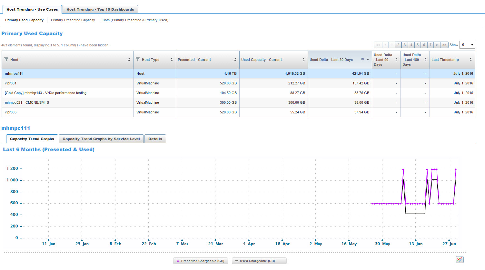

**author:** scott.speer@emc.com

**version:** 4.0

**description:** The concept of the report was easy but the creation of the report was a much different story. The idea behind the report was to allow storage team members insight into where the storage was being allocated/presented and used over a period of time. On top of that, the user should be able to see the details as well as track SLA growth.

What you will see within the reports is host capacity trending based off of VIPR SRM chargeback data. You will be able to sort the different columns, search for specific hosts or look at top 10 dashboards. Keep in mind if you are thin provisioning, you will see the array’s reported LUN used capacity versus if using thick LUNs, you will see the fully allocated LUN capacity as the reported used capacity. Also note that as these reports utilize standard chargeback reports, they are also cluster aware.

Requirements for report to work: SRM 4.0 & Higher, Chargeback SolutionPack has to be installed and configured, Hosts have to be discovered (actively or passively) in order to appear in the report. This is a standard requirement for the base VIPR SRM chargeback reports, A delta formula change is needed in order for the report to work prior to SRM 4.1 (Please see my blog post for the required change if you are running on 4.0.x code).

# CTG -> Health Dashboard - Device Alert Dashboard
<a href="https://raw.githubusercontent.com/coulof/srmreports/master/reports/CTG_-_Host_Capacity_Trending.xml">DOWNLOAD</a>


**author:** scott.speer@emc.com

**version:** 4.0

**description:** Do you sometimes get overwhelmed by all of the alerts that are displayed on the “All Alerts report”?

Do you wish you had an easy way to see the alerts by hardware platform without filtering on the “All Alerts” table?

Do you ever want to trend alerts on a platform to look for patterns on alerts?

If you answered “yes” to any of the above questions, this report might be worth downloading and trying within your environment.

Requirements for report to work: SRM 4.0 & Higher, Alerts have to be enabled for the Array/Fabric SolutionPack you want to appear within the report. Like with all alerting, you can be selective on what alerts you enable. Only enabled alerts will appear within the report.

# Visual VNX Disk Slot Status
<a href="https://raw.githubusercontent.com/coulof/srmreports/master/reports/Visual_VNX_Disk_Slot_Status.xml">DOWNLOAD</a>
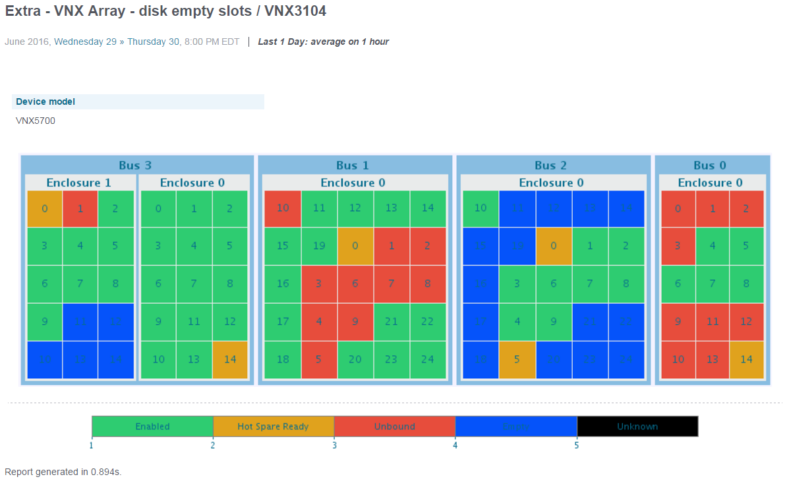

**author:** yanick.heynemand@emc.com 

**version:** 4.0

**description:** Disk's Availability only states the disk availability, no longer tell its status. Partstat property reports on disk/slot status... which is converted back into a value for TreeMap consumption. The report is built to be compatible with 4 disk/slot status: Enabled, HotSpareReady, Unbound, and Empty. Everything else is considered Unknown. This report is providing a visual overview of disk slot status in VNX arrays, while being a good application of TreeMap example. The construction is based on an application of complex expansion of the 'part' property of parttype='Disk'. 'part' property is formatted as 'Bus X Enclosure Y Disk Z' where complex expansion, using regex, recovers the elements, 1 for each level of expansion. The child report under the final report node (Disk) does some formula computing: 1) it counts number of Availability metric (1 per disk) and their status based on partstat property. Only 1 report node should report a status, which is multiplied by a constant value to represent the status. At Disk level, the child values are aggregated, only 1 should "win", and tells about the status. At the top of the report structure, on the Array expansion level, defines the TreeMap report. Size makes use of the constant value (so all cells are of same size) and Color makes use of the output of Conditional Formula while the threshold definition select between green and red. TBV: When data cannot be recovered (Availability metric), the cell is gray (not verified). 

# LUN Used Growth over 1 or 2 weeks
<a href="https://raw.githubusercontent.com/coulof/srmreports/master/reports/LUN_Used_Growth_over_1_or_2_weeks.xml">DOWNLOAD</a>
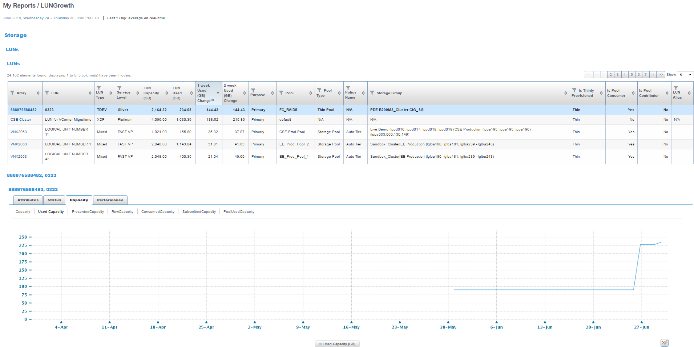

**author:**  graham.brown2@emc.com 

**version:** 4.0

**description:** Although ViPR SRM has great ability to forward forecast based on historical change in data there does not seem to be any reports which highlight LUN used growth over a recent period. I had a customer asking to be able to identify out of all of their LUNs which ones had grown the most over the previous week or 2 weeks. Therefore I have created a report based on Explore/Storage/LUNs which has columns indicating the LUN used growth over the past 7 days and 14 days. By default this is sorted descending on change over previous 1 week.

# Dashboard Performance and Capacity by Location and Business Unit
<a href="https://raw.githubusercontent.com/coulof/srmreports/master/reports/Dashboard_Performance_and_Capacity_by_Location_and_Business_Unit.xml">DOWNLOAD</a>
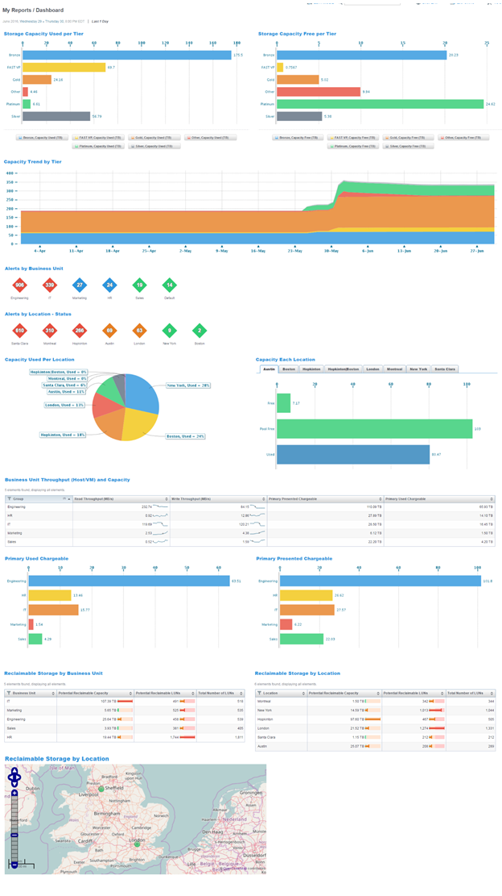

**author:**  graham.brown2@emc.com 

**version:** 4.0

**description:** Often in Proof of Concepts and Demonstrations customers ask to see a top level dashboard showing breakdown of storage across the estate by different dimensions e.g. Tier, Location, Business Service.
This document provides an example report which can be loaded into Lightfoot, vlab or a customer system to quickly demonstrate the following top level views of the data being collected:

1. Storage Capacity Used/Free per Tier
2. Storage Capacity Used Trend per Tier over 3 months
3. Alerts by Location/Business Unit (Status/Geo Map)
4. Capacity Used by Location
5. Business Unit Throughput at the Host/VM level
6. Primary Used Chargeable and Presented Per Business Unit
7. Storage Reclamation by Business Unit / Location (Table/Geo Map)

# Pool Forecast by Array
<a href="https://raw.githubusercontent.com/coulof/srmreports/master/reports/Pool_Forecast_by_Array.xml">DOWNLOAD</a>
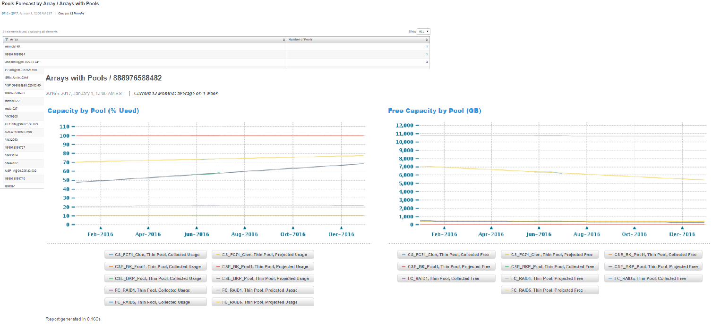

**author:**  graham.brown2@emc.com 

**version:** 4.0

**description:** This report provides a list of Arrays with number of Pools in each array. Drill down on the array produces two graphs per array forecasting over the current 12 months. The first graph shows projected capacity utilization (%) per pool, the second shows projected free (GB) per pool.

# Datastore List with Array and Host information
<a href="https://raw.githubusercontent.com/coulof/srmreports/master/reports/Datastore_List_with_Array_and_Host_information.xml">DOWNLOAD</a>
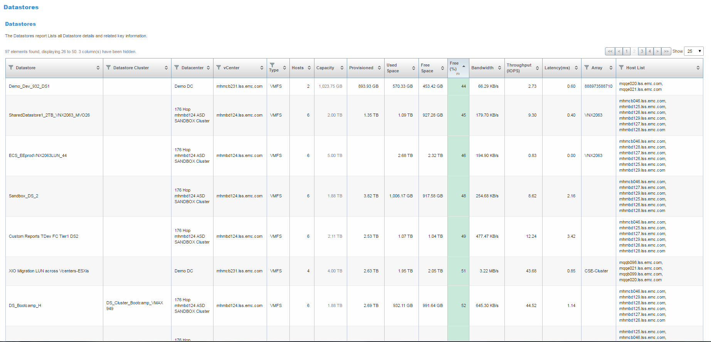

**author:**  graham.brown2@emc.com 

**version:** 4.0

**description:** Enhanced the standard datastore capacity and performance table to include supporting array and hosts using the datastore


# VPLEX Port statistic based on switch port octets
<a href="https://raw.githubusercontent.com/coulof/srmreports/master/reports/VPLEX_Port_statistic_based_on_switch_port_octets.xml">DOWNLOAD</a>
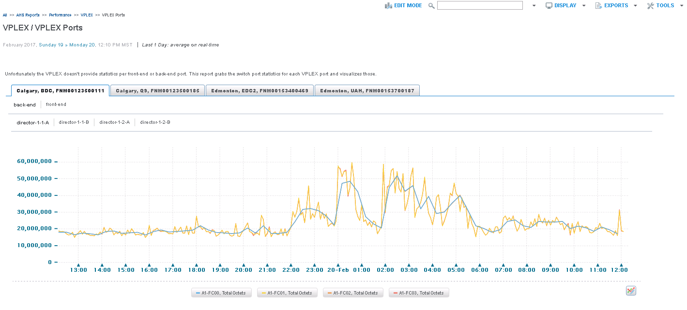

**author:**  Andreas.Weigl@emc.com

**version:** 4.0

**description:** Unfortunately the VPLEX doesn't provide throughput statistics per VPLEX front-end and back-end port (at least in my installation). This report does a complex expansion to get the ifInOctets and ifOutOctets.

My customer has two custom fields: city and dc. You might have to remove those in the expansion of the VPLEX devices. 


# Hypervisor VM load analysis
<a href="https://raw.githubusercontent.com/coulof/srmreports/master/reports/Hypervisor_VM_load_analysis.xml">DOWNLOAD</a>
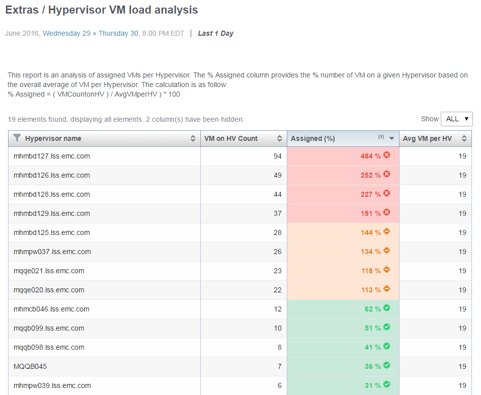

**author:** yanick.heynemand@emc.com 

**version:** 4.0

**description:** This report is an analysis of assigned VMs per Hypervisor. This report proves its usefullness for Administrators wanted to balance the number of VMs across Hypervisor hosts. The % Assigned column provides the % number of VM on a given Hypervisor based on the overall average of VM per Hypervisor. The calculation is as follow: `% Assigned = ( VMCountonHV ) / AvgVMperHV ) * 100`

# CTG -> Tailored Chargeback/Showback Reports
<a href="https://raw.githubusercontent.com/coulof/srmreports/master/reports/CTG_-_Tailored_Chargeback_Showback_Reports.xml">DOWNLOAD</a>

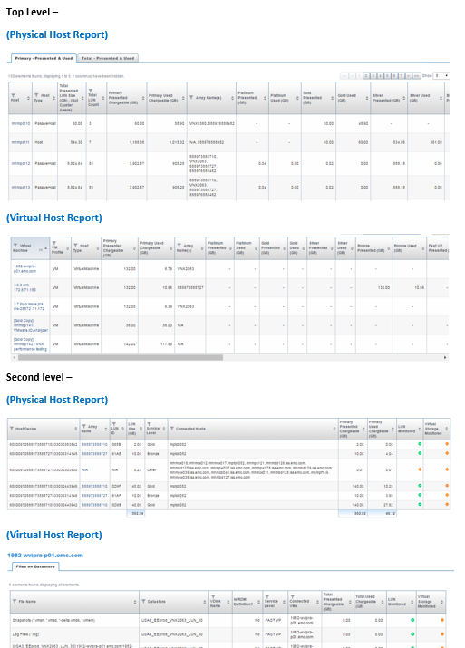

**author:** scott.speer@emc.com

**version:** 4.0

**description:** Tailored chargeback/showback report using default SLAs + Tier0-Tier3. The reports provided presented and used within the same table along with some additional items commonly requested.

Requirements for report to work: SRM 4.0 & Higher, Chargeback SolutionPack has to be installed, Hosts have to be discovered (actively of passively) in order to appear in the report (This is a standard requirement for the base ViPR SRM chargeback reports)

# CTG -> System Performance - SotS Reports
<a href="https://raw.githubusercontent.com/coulof/srmreports/master/reports/CTG_-_System_Performance_-_SotS_Reports.xml">DOWNLOAD</a>

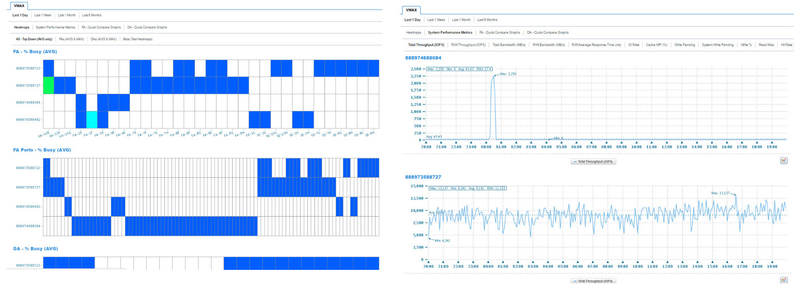

**author:** scott.speer@emc.com

**version:** 4.0

**description:** 7/7/17 Update – I updated my (3) System Performance Reports. Added Unity/VNXe specific reports as well as made minor updates to take advantage of SRM 4.1 functionality.

SotS = State of the State. Compare all device types per metric within the same report.

I have three different system performance reports I have created to provide different ways to look at system performance within SRM. This is one of the three reports. You’ll find the other two under different posts.

This specific report provides a quick way to compare system performance metrics across all devices of the same type (VMAX, VNX, XIO & Isilon). You select the time frame, the metric type and then the metric. Quite a few users utilize this report to determine how systems are doing compared to others as well as for provisioning placements based off load.

Requirements for report to work: SRM 4.0 & Higher, VMAX, VNX, XIO & Isilon systems discovered

# CTG -> VPLEX SV TimeFrame Report
<a href="https://raw.githubusercontent.com/coulof/srmreports/master/reports/CTG_-_VPLEX_SV_TimeFrame_Report.xml">DOWNLOAD</a>

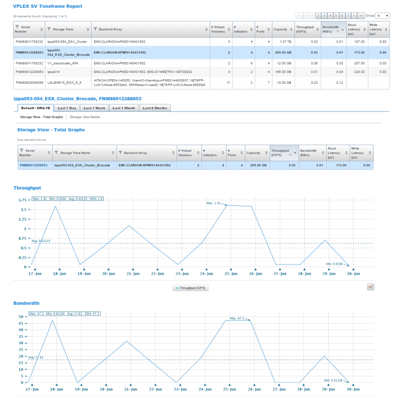

**author:** scott.speer@emc.com

**version:** 4.0

**description:** Historical graphing of VPLEX StorageView Performance.

Checkout my blog post or the attached word doc for full details. https://centraltexasgeek.com/2016/09/20/srm4-vplex-sv-timeframe-report/

# Datastore Utilization
<a href="https://raw.githubusercontent.com/coulof/srmreports/master/reports/Datastore_Utilization.xml">DOWNLOAD</a>

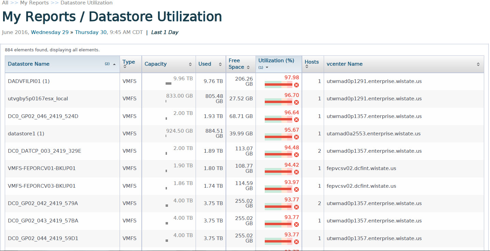

**author:** andy.wilatoski@emc.com

**version:** 4.0

**description:** This report shows the datastore utilization in your environment. It is sorted and shows the vCenter that the datastore is related to.

# Storage Systems - Health (SRM 4.0 Update)
<a href="https://raw.githubusercontent.com/coulof/srmreports/master/reports/Storage_Systems_-_Health_-_SRM_4.0_Update.xml">DOWNLOAD</a>

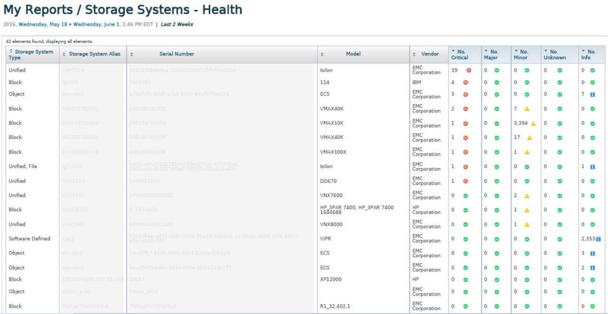

**author:** andy.wilatoski@emc.com

**version:** 4.0

**description:** This report is a Top N of storage array with the most alerts. It helps at first sight to see what are the array which deserves to be looked at.

# Vmguest and Host Primary Presented Allocated and Used Chargeable
<a href="https://raw.githubusercontent.com/coulof/srmreports/master/reports/Vmguest_and_Host_Primary_Presented_Allocated_and_Used_Chargeable.xml">DOWNLOAD</a>

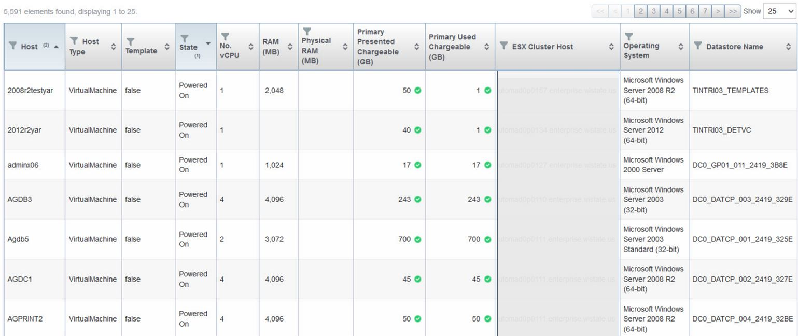

**author:** andy.wilatoski@emc.com

**version:** 4.0

**description:** This report shows chargeback amounts for CPU, RAM and Storage for Vmguests and physical servers on one report. The storage columns are primary presented and primary used.

# Isilon and DataDomain Executive Dashboard
<a href="https://raw.githubusercontent.com/coulof/srmreports/master/reports/Isilon_and_DataDomain_Executive_Dashboard.xml">DOWNLOAD</a>

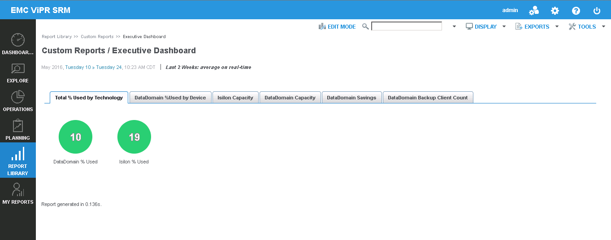

**author:** aaron.norton@emc.com

**version:** 4.0

**description:** This is a high level Executive Dashboard that primarily focuses on capacity utilization of Isilon and DataDomain devices. It also has a report that shows capacity savings of DataDomain due to deduplication and compression.

# Vmguest and Host Primary Presented-Total Allocated and Used-Total Chargeable
<a href="https://raw.githubusercontent.com/coulof/srmreports/master/reports/Vmguest_and_Host_Primary_Presented-Total_Allocated_and_Used-Total_Chargeable.xml">DOWNLOAD</a>

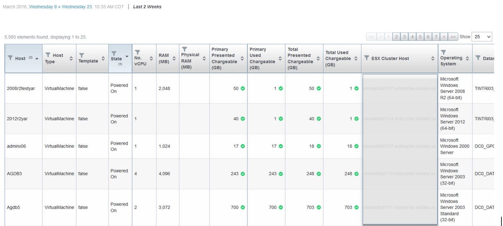

**author:** andy.wilatoski@emc.com

**version:** 4.0

**description:** This report shows chargeback amounts for CPU, RAM and Storage for Vmguests and physical servers on one report. The storage columns are primary presented, primary used, total presented, and total used.

# Storage Utilization for Different Kinds of Arrays in ViPR SRM (Trending)
<a href="https://raw.githubusercontent.com/coulof/srmreports/master/reports/Storage_Utilization_for_Different_Kinds_of_Arrays_in_ViPR_SRM_Trending.xml">DOWNLOAD</a>

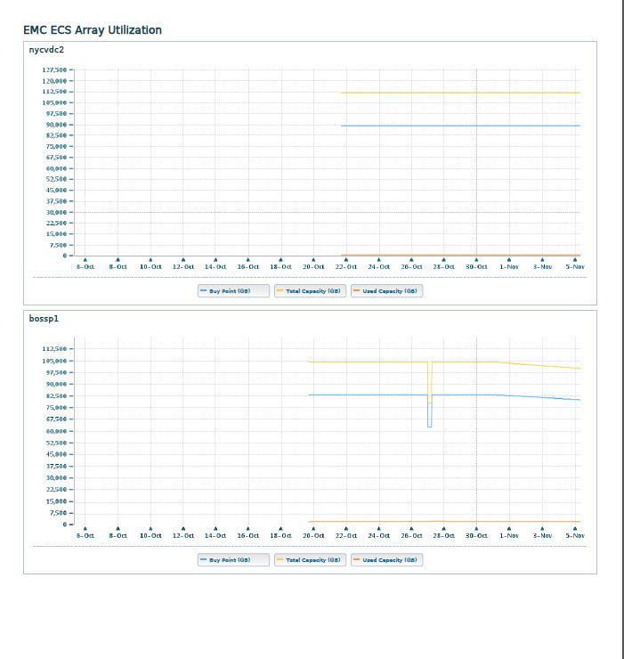

**author:** andy.wilatoski@emc.com

**version:** 4.0

**description:** Hi Guys, In some of my spare time I have created a trending report that shows all the arrays listed below in a line graph format. This way a customer can see what is the total usable capacity in an array in ViPR SRM and how much of that is used over time. Hope you like it.

Arrays to Storage Items Supported: EMC Atmos Array Utilization, EMC Centera Array Utilization, EMC Data Domain Array Utilization, EMC ECS Array Utilization, EMC Isilon Array Utilization, EMC VMAX Array Utilization, EMC VNX Array Utilization, EMC ScaleIO Array Utilization, EMC XtremIO Array Utilization, Hitachi Array Utilization, HP EVA Array Utilization, HP 3PAR Array Utilization, HP StorageWorks Array Utilization, IBM XIV Array Utilization, Netapp Filer Array Utilization

# Storage Consumed by Application
<a href="https://raw.githubusercontent.com/coulof/srmreports/master/reports/Storage_Consumed_by_Application.xml">DOWNLOAD</a>

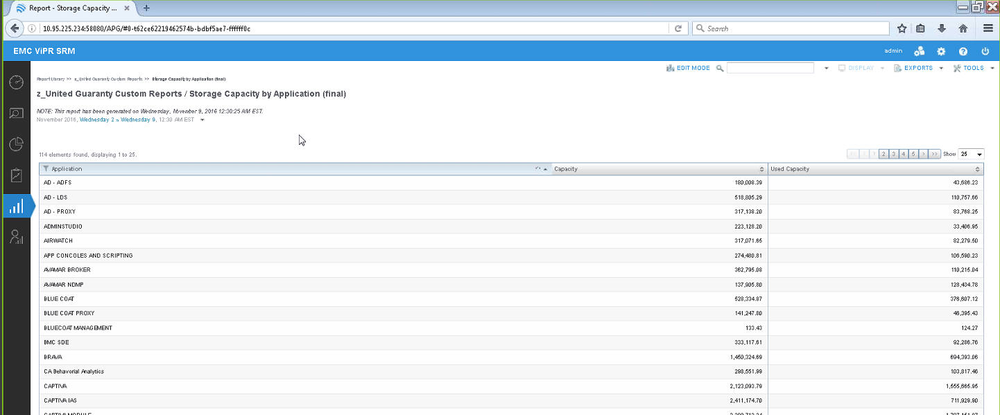

**author:** bill.duffy@emc.com

**version:** 4.0

# Storage System Capacity Consumption
<a href="https://raw.githubusercontent.com/coulof/srmreports/master/reports/Storage_System_Capacity_Consumption.n.xml">DOWNLOAD</a>


**author:** bill.duffy@emc.com

**version:** 4.0

# CTG -> System Performance - By Device Reports
<a href="https://raw.githubusercontent.com/coulof/srmreports/master/reports/CTG_-_System_Performance_-_By_Device_Reports.xml">DOWNLOAD</a>

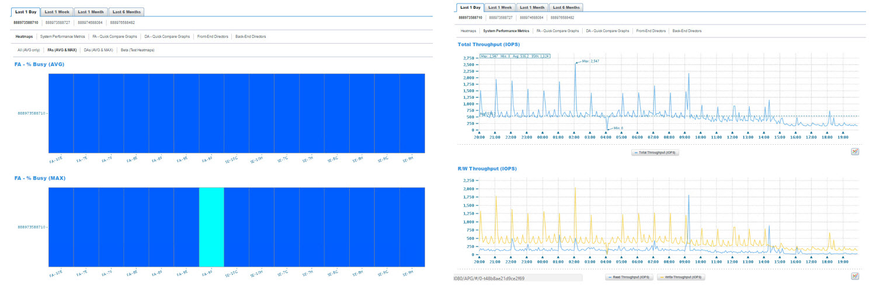

**author:** scott.speer@emc.com

**version:** 4.0

**description:** 7/7/17 Update – I updated my (3) System Performance Reports. Added Unity/VNXe specific reports as well as made minor updates to take advantage of SRM 4.1 functionality.

I have three different system performance reports I have created to provide different ways to look at system performance within SRM. This is one of the three reports. You’ll find the other two under different posts.

This specific report provides a quick way to look at all system performance metrics of a single VMAX, VNX , XIO or Isilon frame. You select the time frame, select the array and then select the metric types from the third set of tabs. Some systems introduce a fourth set of tabs to allow for drilling in further.

Requirements for report to work: SRM 4.0 & Higher, VMAX, VNX, XIO & Isilon systems discovered

# CTG -> System Performance - TimeFrame Compare
<a href="https://raw.githubusercontent.com/coulof/srmreports/master/reports/CTG_-_System_Performance_-_TimeFrame_Compare.xml">DOWNLOAD</a>

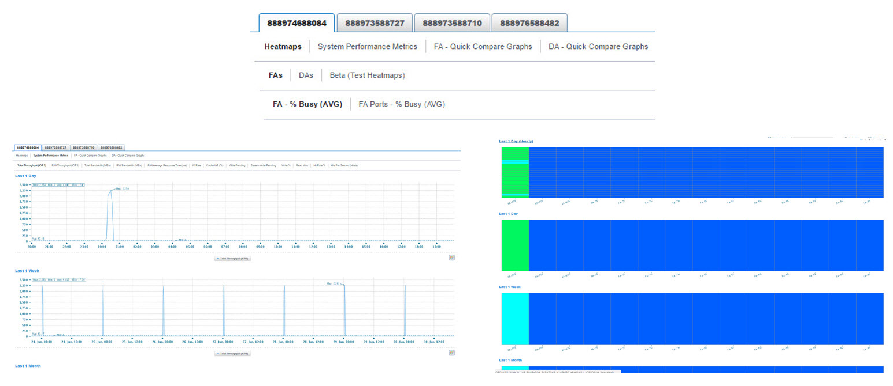

**author:** scott.speer@emc.com

**version:** 4.0

**description:** 7/7/17 Update – I updated my (3) System Performance Reports. Added Unity/VNXe specific reports as well as made minor updates to take advantage of SRM 4.1 functionality.

I have three different system performance reports I have created to provide different ways to look at system performance within SRM. This is one of the three reports. You’ll find the other two under different posts.

This specific report provides a quick way to compare timeframes (Last 1 Day, Last 1 Week, Last 1 Month, Last 6 Months) of a device and an associated metric within the same report. You select the device/frame, then the metric type. Most people use this specific report to look for trends per device.

Requirements for report to work: SRM 4.0 & Higher, VMAX, VNX, XIO & Isilon systems discovered

# CTG -> Array-Pool Capacity Reports (Capacity Planning & Forescasting Report Bundle)
<a href="https://raw.githubusercontent.com/coulof/srmreports/master/reports/CTG_-_Array-Pool_Capacity_Reports_Capacity_Planning_n_Forescasting_Report_Bundle.xml">DOWNLOAD</a>

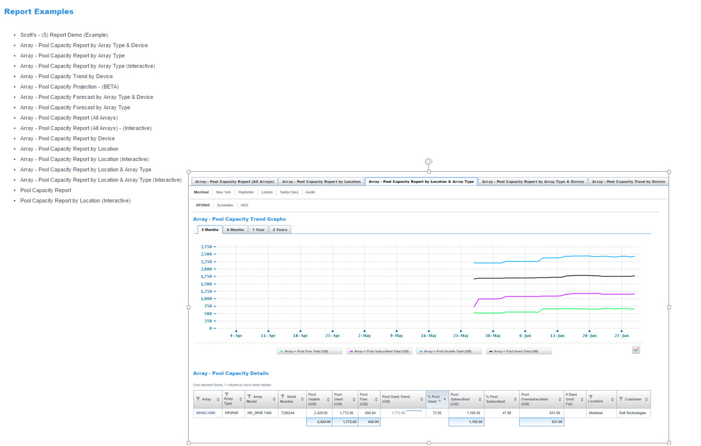

**author:** scott.speer@emc.com

**version:** 4.0

**description:** This is a report bundle with quite a few different examples of how to graph and present pool based data. Some utilize data enrichment while others just show a different way of looking at SRM data.

Requirements for report to work: SRM 4.0 & Higher, Arrays that utilizes pools will only appear in the reports


# Simple Capacity Planning
<a href="https://raw.githubusercontent.com/coulof/srmreports/master/reports/Simple_Capacity_Planning.xml">DOWNLOAD</a>

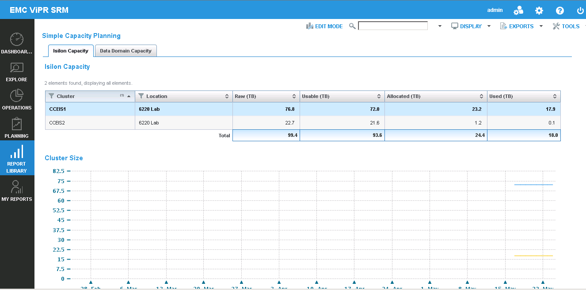

**author:** aaron.norton@emc.com

**version:** 4.0

**description:** This is my simple capacity planning report converted to work with ViPR SRM 4.0. It displays capacity information for multiple technologies within an SRM environment on a single page. It currently supports Isilon, Data Domain, IBM SVC, VMAX, VNX Block, XIV and XtremIO. It displays things like Raw, Usable, and Used capacity. Each device when clicked will show the capacity trend over the last quarter.

# Isilon Quota Reports
<a href="https://raw.githubusercontent.com/coulof/srmreports/master/reports/Isilon_Quota_Reports.xml">DOWNLOAD</a>

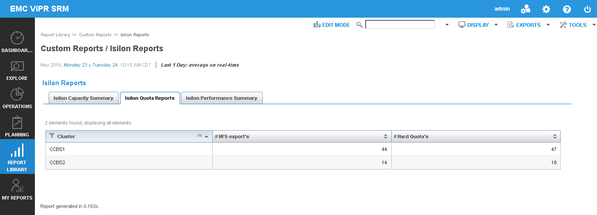

**author:** aaron.norton@emc.com

**version:** 4.0

**description:** This report displays a table of Isilon clusters and how many NFS shares and Hard Quotas are on each cluster. It could easily be modified to show CIFS shares and/or Soft Quotas if necessary. Clicking on a cluster takes you to another table showing each share, the clients it is exported to, and the current utilization. Clicking on an individual share shows the historical utilization.

# Isilon Performance Summary
<a href="https://raw.githubusercontent.com/coulof/srmreports/master/reports/Isilon_Performance_Summary.xml">DOWNLOAD</a>

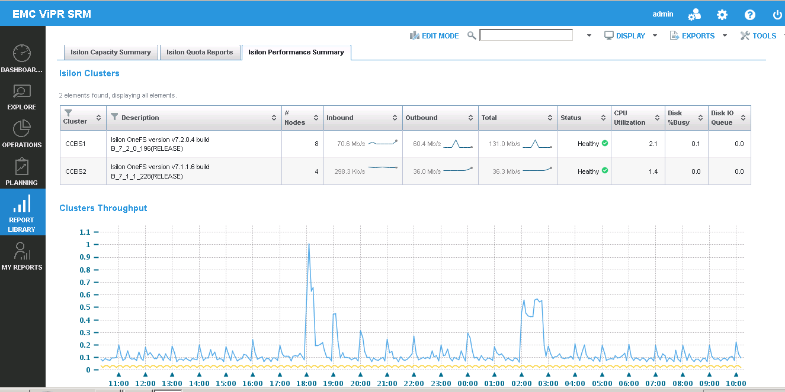

**author:** aaron.norton@emc.com

**version:** 4.0

**description:** This is my Isilon Performance Summary converted to work with ViPR SRM 4.0. It displays Performance information for Isilon clusters. It starts with total throughput per cluster but then breaks down to show specific details like IO Queue, number of connections, Disk %Busy, CPU %Busy, Interface usage, etc. This is a helpful report for Operations teams to get a quick overview of the health of their Isilon clusters.

# Isilon Capacity Summary
<a href="https://raw.githubusercontent.com/coulof/srmreports/master/reports/Isilon_Capacity_Summary.xml">DOWNLOAD</a>

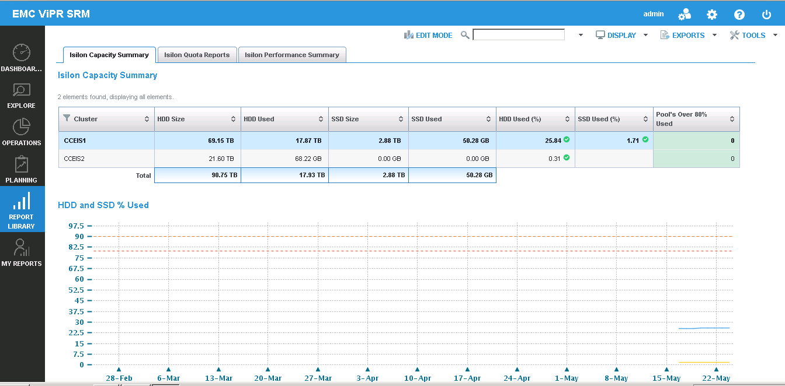

**author:** aaron.norton@emc.com

**version:** 4.0

**description:** Isilon Capacity report that shows and interactive table of Isilon clusters and a chart with the total % used of the HDD and SSD disks in the cluster. Below that chart is another interactive table that shows the pools on the currently selected cluster in the top table. Clicking on a pool displays a chart below with the Usable and Used capacity for that pool.

# Vmguest Health Check Last 6 Months
<a href="https://raw.githubusercontent.com/coulof/srmreports/master/reports/Vmguest_Health_Check_Last_6_Months.xml">DOWNLOAD</a>

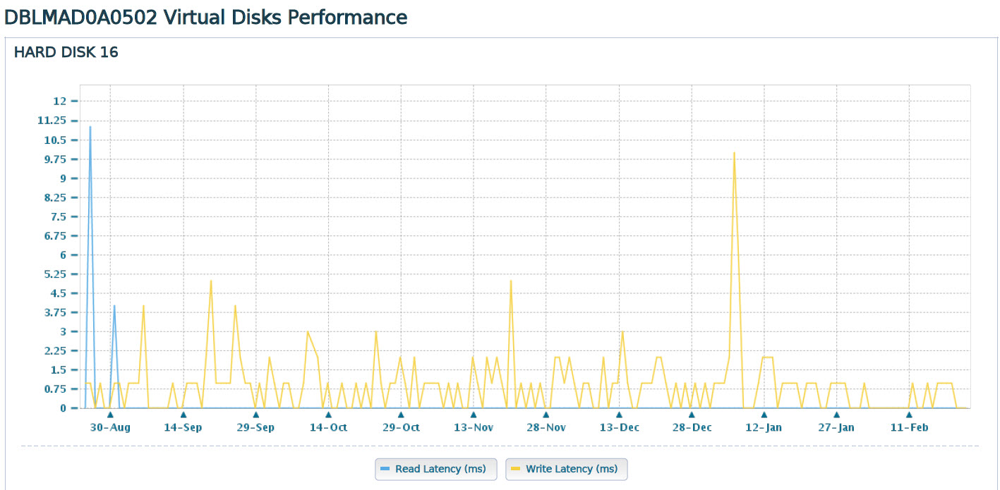

**author:** andy.wilatoski@emc.com

**version:** 4.0

**description:** This report will show a user everything you wanted to know about a Vmguest to troubleshoot if there is a storage problem with the server or is it CPU or RAM that is the issue. In this report you will be able to see latency, storage usage, file system usage, CPU usage, and RAM usage. When these are seen on one screen the user will be able to find out why a server might be slow or having an issue. This report requires a user to edit each section with the name of the server you are researching. Hope you enjoy

# System Summary Report
<a href="https://raw.githubusercontent.com/coulof/srmreports/master/reports/System_Summary_Report.xml">DOWNLOAD</a>

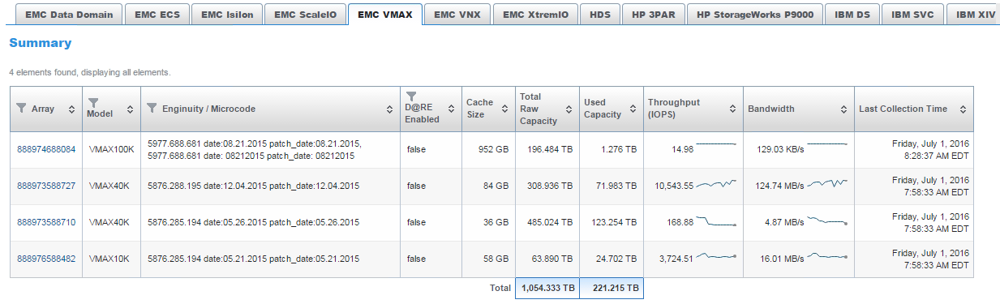

**author:** scott.speer@emc.com

**version:** 4.0

**description:** Nothing fancy, just provided an easy way for customers to quickly review their system summary reports without have to go to each individual SP.
